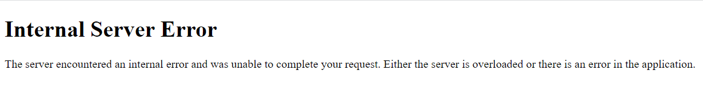
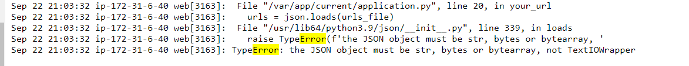
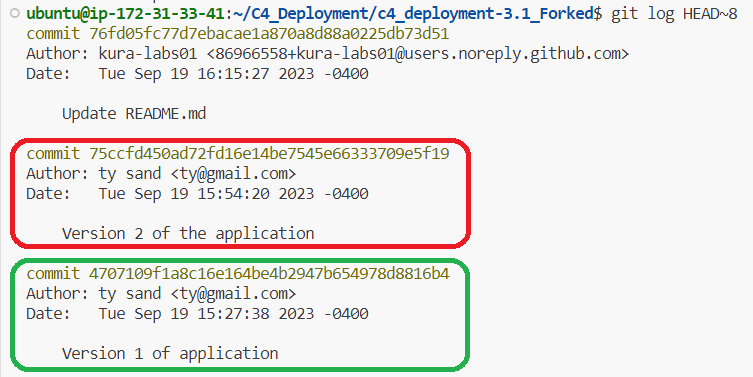
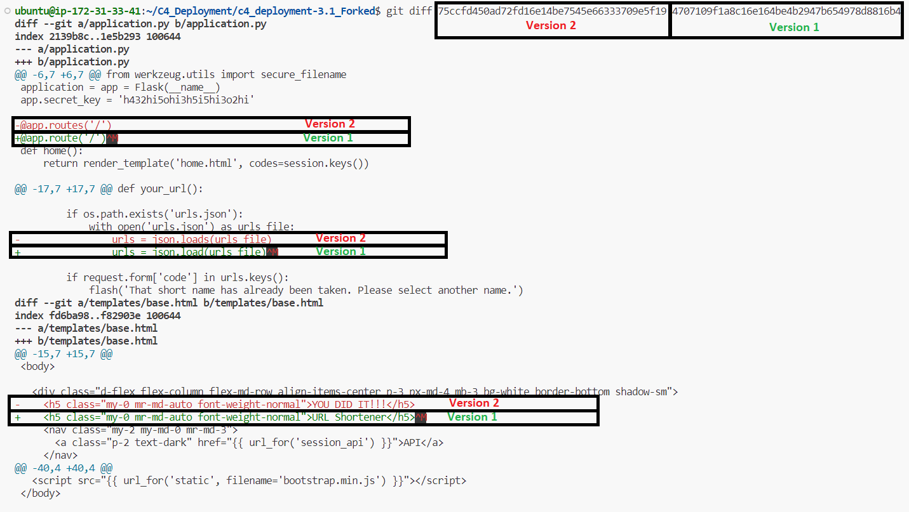
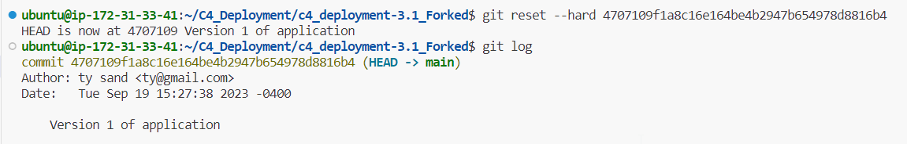
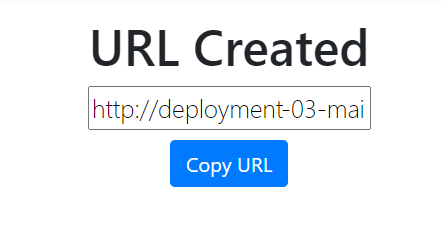

# Automate Build, Test and Deploy URL Shortener Application in Stages

September 22, 2023

By:  Annie V Lam - Kura Labs

# Background

We’re a tech start-up company with a URL shortener tool. We have a SLA with Nike to provide them access to our URL shortener. In the SLA, we are only allowed 20 minutes of downtime a year. If anything happens to the URL shortener, we must communicate any incidents to Nike.

## Incident

A new hire was tasked with updating the URL shortener. The new hire committed version 2 of the application to the main branch. Which automatically triggered a build, test, and deploy to the production server, replacing version 1 of the application running on the server.

## Post-Incident Report
The URL Shortener launched, but when testing the function, the URL Shortener was giving Internal Server Error with a 500 code:

Since the page was able to launch it is not an Web Server issue.  The issue was with web shortener logic, therefore the issue should be within the application.py file.
We pulled the log file for the Elastic Beansalk production environment and did an error search and the error was pertaining to an error code realated to the wrong json medthod was used:

We looked at the logs to see when was Version 1 and Version 2 commited:

We also compared the difference between Version 1 and Version 2 of the application:

As we the new hire's work was not reviewed before it was put into production, we decided that we will not keep the history of the new hire's works and did a git reset --hard:

It worked:

## Conclusion

We reverted back to a previous known working commit and that resolved the issue.  There are multiple ways to resove this, but fastest way is to rollback to a known working histroy.  The other option is to just troubleshoot the application.py file itself.

Moving forward, we will have a more centralized controll on what gets pushed out to productions and have managers review the work of their staff.  

This incident was reported to Nike.

  

  

  

